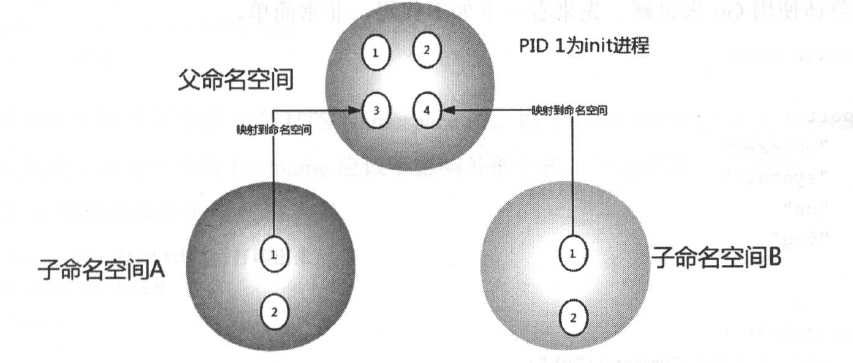

# **第二章**

## **Linux Namespace**

Kernel中的一个功能，便于隔离一系列的系统资源，如：

-   PID；
-   User ID；
-   Network；
-   ……

>   **Namespace和chroot命令有些类似，但是比chroot强大的多！**
>
>   关于chroot：
>
>   -   [Linux中的chroot命令](https://jasonkayzk.github.io/2021/06/26/Linux中的chroot命令/)

>   **用途：**
>
>   例如：Namespace可以做到UID级别的隔离，即：以UID为n的用户，虚拟化出来一个Namespace，在这个Namespace中，用户具有root权限！（但是在真实的物理机器上，他还是UID为n的用户！）

命令空间建立起系统不同的视图，从用户的角度来看，每一个命名空间都如同一台单独的Linux计算机一样，有自己的init进程（PID为1），其他进程的PID依次递增！

例如下图：



A和B空间均存在PID为1的init进程，子命名空间的进程映射至父命名空间的进程上；

因此：**父命名空间可以知道每个子命名空间的运行状态，而子命名空间之间是相互隔离的！**

目前，Linux一共实现了6种不同类型的Namespace：

| **Namespace类型** | **系统调用参数** | **内核版本** |
| ----------------- | ---------------- | ------------ |
| Mount Namespace   | CLONE_NEWNS      | 2.4.19       |
| UTS Namespace     | CLONE_NEWUTS     | 2.6.19       |
| IPC Namespace     | CLONE_NEWIPC     | 2.6.19       |
| PID Namespace     | CLONE_NEWPID     | 2.6.24       |
| Network Namespace | CLONE_NEWNET     | 2.6.29       |
| User Namespace    | CLONE_NEWUSER    | 3.8          |

Namespace API主要使用以下三个系统调用：

-   clone()：创建新进程；根据调用参数来判断哪些类型的Namespace被创建，并且由他创建的子进程会被包含到这些Namespace中！
-   unshare()：将进程移出某个Namespace；
-   setns()：将进程加入到Namespace中；

<br/>

### **UTS Namespace**

用来隔离nodename和domainname两个系统标识；

**在UTS Namespace中，每个Namespace允许拥有自己的hostname！**

下面是代码：

chapter2_basic/namespace/uts_namespace_demo.go

```go
func main() {
	cmd := exec.Command("sh")
	cmd.SysProcAttr = &syscall.SysProcAttr{
		Cloneflags: syscall.CLONE_NEWUTS,
	}
	cmd.Stdin = os.Stdin
	cmd.Stdout = os.Stdout
	cmd.Stderr = os.Stderr

	if err := cmd.Run(); err != nil {
		log.Fatal(err)
	}
}
```

代码解释：

-   `exec.Command("sh")`指定被fork出来的新进程内的初始命令`sh`；
-   使用`CLONE_NEWUTS`创建新的UTS命名空间并将`clone()`系统调用后的新的子进程加入；
-   `cmd.StdXXX = os.StdXXX`：当前进程和子进程输入输出流绑定；

运行代码：

```bash
root@jasonkay:~/workspace/my_docker/chapter2_basic# go run namespace/uts_namespace_demo.go 
#
```

进入一个sh运行环境中；

查看进程关系：

```bash
# pstree -pl
systemd(1)─┬─VGAuthService(843)
├─sshd(941)───sshd(1095)─┬─bash(4096)───go(15135)─┬─uts_namespace_d(15232)─┬─sh(15237)───pstree(15246)
           │                        │                        │                        ├─{uts_namespace_d}(15233)
           │                        │                        │                        ├─{uts_namespace_d}(15234)
           │                        │                        │                        ├─{uts_namespace_d}(15235)
           │                        │                        │                        └─{uts_namespace_d}(15236)
           │                        │                        ├─{go}(15136)
……

## 输出当前PID
# echo $$ 
15237
```

验证父子进程不在同一个UTS命名空间中：

```bash
# readlink /proc/15237/ns/uts
uts:[4026532644]
# readlink /proc/15232/ns/uts
uts:[4026531838]
```

可以看到，的确不在同一个UTS命名空间！

查看hostname：

```bash
# 查看hostname
# hostname
jasonkay

# 修改hostname
# hostname -b zk

# 再次查看hostname
# hostname
zk
```

在宿主机启动另一个Shell，并查看hostname：

```bash
root@jasonkay:~# hostname
jasonkay
```

可以看到：外部的hostname并没有被内部的修改所影响！

<br/>

### **IPC Namespace**

IPC命名空间用来隔离System V IPC和 POSIX message queues；

chapter2_basic/namespace/ipc_namespace_demo.go

```go
func main() {
	cmd := exec.Command("sh")
	cmd.SysProcAttr = &syscall.SysProcAttr{
		Cloneflags: syscall.CLONE_NEWUTS | syscall.CLONE_NEWIPC,
	}
	cmd.Stdin = os.Stdin
	cmd.Stdout = os.Stdout
	cmd.Stderr = os.Stderr

	if err := cmd.Run(); err != nil {
		log.Fatal(err)
	}
}
```

代码增加了`CLONE_NEWIPC`，代表同时创建IPC命名空间；

下面进行测试（需要同时在宿主机上打开两个Shell）；

```bash
# 查询现有ipc message queues
root@jasonkay:~# ipcs -q

------ Message Queues --------
key        msqid      owner      perms      used-bytes   messages    

# 创建一个message queue
root@jasonkay:~# ipcmk -Q
Message queue id: 0

# 再次查看
root@jasonkay:~# ipcs -q

------ Message Queues --------
key        msqid      owner      perms      used-bytes   messages    
0x5336d6db 0          root       644        0            0           

```

此时已经存在一个queue了！

使用另外一个shell运行程序：

```bash
root@jasonkay:~/workspace/my_docker/chapter2_basic# go run namespace/ipc_namespace_demo.go 
# ipcs -q

------ Message Queues --------
key        msqid      owner      perms      used-bytes   messages    

```

可以发现，新的命名空间，看不到宿主机的消息队列！

<br/>

### **PID Namespace**

PID命名空间用来隔离进程ID：

**同一个进程在不同的PID命名空间可以拥有不同的PID！**

>   例如：
>
>   在Docker容器中使用`ps -ef`可以发现：容器内前台运行的进程PID为1，但是在容器外却是不同的PID；

代码如下：

chapter2_basic/namespace/pid_namespace_demo.go

```go
func main() {
	cmd := exec.Command("sh")
	cmd.SysProcAttr = &syscall.SysProcAttr{
		Cloneflags: syscall.CLONE_NEWUTS | syscall.CLONE_NEWIPC | syscall.CLONE_NEWPID,
	}
	cmd.Stdin = os.Stdin
	cmd.Stdout = os.Stdout
	cmd.Stderr = os.Stderr

	if err := cmd.Run(); err != nil {
		log.Fatal(err)
	}
}
```

下面进行测试：

```bash
# 启动子进程 
root@jasonkay:~/workspace/my_docker/chapter2_basic# go run namespace/pid_namespace_demo.go 
#

# 宿主机查看
root@jasonkay:~# pstree -pl
systemd(1)─┬─VGAuthService(843)
          ├─sshd(941)───sshd(1095)─┬─bash(4096)───go(16024)─┬─pid_namespace_d(16119)─┬─sh(16124)
           │                        │                        │                        ├─{pid_namespace_d}(16120)
           │                        │                        │                        ├─{pid_namespace_d}(16121)
           │                        │                        │                        ├─{pid_namespace_d}(16122)
           │                        │                        │                        └─{pid_namespace_d}(16123)
           │                        │                        ├─{go}(16025)
……

# 容器内sh查看
# echo $$
1
```

可以看到，PID被映射到了1上；

>   **注：此时不能使用`ps`命令查看！**
>
>   **因为`ps`和`top`命令使用的是`/proc`中的内容，而此时我们没有修改挂载(Mount)命名空间！**

<br/>

### **Mount Namespace**

**Mount命名空间用来隔离各个进程看到的挂载点视图：**

**在不同的命名空间中的进程看到的文件系统层次是不同的，并且在新的Mount命名空间中调用`mount()`和`unmount`仅仅影响当前命名空间内的文件系统，而对全局的文件系统没有影响！**

>   **这个命名空间的功能类似于`chroot`，但是实现比这个系统调用更加灵活和安全！**

>   **Mount命名空间的系统调用参数为`NEWNS`；**
>
>   **这是因为，Mount命名空间是Linux第一个实现的命名空间类型，当时还没有意识到还有其他更多类型的命名空间出现！**

下面是代码：

chapter2_basic/namespace/mount_namespace_demo.go

```go
func main() {
	cmd := exec.Command("sh")
	cmd.SysProcAttr = &syscall.SysProcAttr{
		Cloneflags: syscall.CLONE_NEWUTS | syscall.CLONE_NEWIPC |
			syscall.CLONE_NEWPID | syscall.CLONE_NEWNS,
	}
	cmd.Stdin = os.Stdin
	cmd.Stdout = os.Stdout
	cmd.Stderr = os.Stderr

	if err := cmd.Run(); err != nil {
		log.Fatal(err)
	}
}
```

首先运行代码，并查看`/proc`目录中的内容：

```bash
root@jasonkay:~/workspace/my_docker/chapter2_basic# go run namespace/mount_namespace_demo.go 
# ls /proc
1      130    144    163    2    272  310  331  4096  57    810   9441         iomem         pressure
10     1302   145    16385  20   273  311  332  41    58    812   951          ioports       sched_debug
10720  13095  146    164    206  274  312  333  413   582   813   957          irq           schedstat
1095   13098  147    16434  21   275  313  334  42    59    814   966          kallsyms      scsi
11     131    148    165    22   276  314  335  438   6     815   991          kcore         self
1100   13369  149    16522  23   277  315  336  44    60    839   acpi         keys          slabinfo
1102   13370  15     16527  24   278  316  337  45    64    843   asound       key-users     softirqs
11129  13384  150    16530  258  279  317  338  46    65    845   buddyinfo    kmsg          stat
117    134    151    166    259  28   318  339  47    66    877   bus          kpagecgroup   swaps
11713  135    152    167    26   280  319  34   478   67    879   cgroups      kpagecount    sys
118    137    153    168    260  281  32   35   479   6758  893   cmdline      kpageflags    sysrq-trigger
119    138    154    169    261  282  320  36   48    68    899   consoles     loadavg       sysvipc
12     13873  155    17     262  283  321  366  480   69    9     cpuinfo      locks         thread-self
12563  13874  156    172    263  284  322  38   50    786   901   crypto       mdstat        timer_list
12570  13875  157    173    264  285  323  384  51    787   907   devices      meminfo       tty
126    139    158    174    265  286  324  385  514   788   908   diskstats    misc          uptime
12608  14     159    175    266  287  325  387  52    789   909   dma          modules       version
127    140    16     176    267  29   326  388  521   790   920   driver       mounts        version_signature
1275   141    160    178    268  3    327  389  53    799   928   execdomains  mpt           vmallocinfo
128    14132  16013  179    269  30   328  39   538   800   9284  fb           mtrr          vmstat
1286   142    161    18     27   304  329  4    54    802   929   filesystems  net           zoneinfo
129    143    162    190    270  308  33   40   554   803   941   fs           pagetypeinfo
13     1432   16252  193    271  309  330  401  56    805   9440  interrupts   partitions
```

>   **`/proc`是一个文件系统，提供额外机制，通过内核和内核模块将信息发送给进程！**

此时`/proc`为宿主机的，因此看到里面会比较乱；

下面将`/proc` mount 至自己的Namespace下：

```bash
# mount -t proc proc /proc
# ls /proc
1          consoles     fb           kcore        locks    net           slabinfo       timer_list
5          cpuinfo      filesystems  keys         mdstat   pagetypeinfo  softirqs       tty
acpi       crypto       fs           key-users    meminfo  partitions    stat           uptime
asound     devices      interrupts   kmsg         misc     pressure      swaps          version
buddyinfo  diskstats    iomem        kpagecgroup  modules  sched_debug   sys            version_signature
bus        dma          ioports      kpagecount   mounts   schedstat     sysrq-trigger  vmallocinfo
cgroups    driver       irq          kpageflags   mpt      scsi          sysvipc        vmstat
cmdline    execdomains  kallsyms     loadavg      mtrr     self          thread-self    zoneinfo
```

可以看到少了非常多！

此时再使用`ps`查看系统进程：

```bash
# ps -ef
UID          PID    PPID  C STIME TTY          TIME CMD
root           1       0  0 20:36 pts/1    00:00:00 sh
root           6       1  0 20:40 pts/1    00:00:00 ps -ef
```

可以看到，当前命名空间中 sh 进程为PID为 1 的进程，而当前的 Mount命名空间和外部是隔离的！

>   **Docker Volumn也是利用了这个特性！**

>   <red>**注：试验结束后，需要在容器中执行`umount /proc`取消挂载，否则会影响到外部挂载！**</font>
>
>   **（这是受`systemd`影响的！后面会介绍如何避免受影响！）**
>
>   ```bash
>   # umount /proc
>   # ls /proc
>   1      130    144    163    193  271  309  330  401   56    805   9440         interrupts    partitions
>   10     1302   145    164    2    272  310  331  4096  57    810   9441         iomem         pressure
>   10720  13095  146    16434  20   273  311  332  41    58    812   951          ioports       sched_debug
>   1095   13098  147    165    206  274  312  333  413   582   813   957          irq           schedstat
>   11     131    148    16522  21   275  313  334  42    59    814   966          kallsyms      scsi
>   1100   13369  149    16527  22   276  314  335  438   6     815   991          kcore         self
>   1102   13370  15     166    23   277  315  336  44    60    839   acpi         keys          slabinfo
>   11129  13384  150    167    24   278  316  337  45    64    843   asound       key-users     softirqs
>   117    134    151    16706  258  279  317  338  46    65    845   buddyinfo    kmsg          stat
>   11713  135    152    16716  259  28   318  339  47    66    877   bus          kpagecgroup   swaps
>   118    137    153    16755  26   280  319  34   478   67    879   cgroups      kpagecount    sys
>   119    138    154    168    260  281  32   35   479   6758  893   cmdline      kpageflags    sysrq-trigger
>   12     13873  155    169    261  282  320  36   48    68    899   consoles     loadavg       sysvipc
>   12563  13874  156    17     262  283  321  366  480   69    9     cpuinfo      locks         thread-self
>   12570  13875  157    172    263  284  322  38   50    786   901   crypto       mdstat        timer_list
>   126    139    158    173    264  285  323  384  51    787   907   devices      meminfo       tty
>   12608  14     159    174    265  286  324  385  514   788   908   diskstats    misc          uptime
>   127    140    16     175    266  287  325  387  52    789   909   dma          modules       version
>   1275   141    160    176    267  29   326  388  521   790   920   driver       mounts        version_signature
>   128    14132  16013  178    268  3    327  389  53    799   928   execdomains  mpt           vmallocinfo
>   1286   142    161    179    269  30   328  39   538   800   9284  fb           mtrr          vmstat
>   129    143    162    18     27   304  329  4    54    802   929   filesystems  net           zoneinfo
>   13     1432   16252  190    270  308  33   40   554   803   941   fs           pagetypeinfo
>   ```
>
>   umount后，挂载恢复！

<br/>

### **User Namespace**

User命名空间用于隔离用户的用户组，即：

**一个进程的UserId和GroupId在User命名空间内外可以是不同的！**

>   例如：
>
>   在宿主机上以一个非root用户创建一个User命名空间，而在User命名空间里面映射为root！

>   **注：在 Linux Kernel 3.8开始，非root进程也可以创建User命名空间了！**

代码如下：

chapter2_basic/namespace/user_namespace_demo.go

```go
func main() {
	cmd := exec.Command("sh")
	cmd.SysProcAttr = &syscall.SysProcAttr{
		Cloneflags: syscall.CLONE_NEWUTS | syscall.CLONE_NEWIPC |
			syscall.CLONE_NEWPID | syscall.CLONE_NEWNS | syscall.CLONE_NEWUSER,
		/*
			以下两种情况，会导致UidMappings/GidMappings中设置了非当前进程所属UID和GID的相关数值：
			1. HostID非本进程所有（与Getuid()和Getgid()不等）
			2. Size大于1 （则肯定包含非当前进程的UID和GID）
			则需要Host机使用Root权限才能正常执行此段代码。

			Issue #3 error about User Namespace：
				https://github.com/xianlubird/mydocker/issues/3
		*/
		UidMappings: []syscall.SysProcIDMap{
			{
				ContainerID: 1,
				HostID:      syscall.Getuid(),
				Size:        1,
			},
		},
		GidMappings: []syscall.SysProcIDMap{
			{
				ContainerID: 1,
				HostID:      syscall.Getgid(),
				Size:        1,
			},
		},
	}

	cmd.Stdin = os.Stdin
	cmd.Stdout = os.Stdout
	cmd.Stderr = os.Stderr

	if err := cmd.Run(); err != nil {
		log.Fatal(err)
	}

	os.Exit(-1)
}
```

**需要注意的是：这里配置了Uid和Gid的映射；**

>   **不同的操作系统可能要求是不同的，这里建议使用Ubuntu操作系统！**

下面进行测试：

```bash
# 宿主机查看当前用户和用户组
root@jasonkay:~# id
uid=0(root) gid=0(root) groups=0(root)
```

可以看到，此时是root用户；

运行程序：

```bash
root@jasonkay:~/workspace/my_docker/chapter2_basic# go run namespace/user_namespace_demo.go 
$ id
uid=1(daemon) gid=1(daemon) groups=1(daemon)
```

可以看到，他们的UID是不同的！

<br/>

### **Network Namespace**

Network命名空间用来隔离网络设备、IP地址等；

**Network命名空间可以让每个容器拥有自己独立的（虚拟）网络设备，并且容器内的应用可以绑定到自己的端口，并且不会冲突！**

代码如下：

chapter2_basic/namespace/network_namespace_demo.go

```go
func main() {
	cmd := exec.Command("sh")
	cmd.SysProcAttr = &syscall.SysProcAttr{
		Cloneflags: syscall.CLONE_NEWUTS | syscall.CLONE_NEWIPC |
			syscall.CLONE_NEWPID | syscall.CLONE_NEWNS |
			syscall.CLONE_NEWUSER | syscall.CLONE_NEWNET,
		UidMappings: []syscall.SysProcIDMap{
			{
				ContainerID: 1,
				HostID:      syscall.Getuid(),
				Size:        1,
			},
		},
		GidMappings: []syscall.SysProcIDMap{
			{
				ContainerID: 1,
				HostID:      syscall.Getgid(),
				Size:        1,
			},
		},
	}

	cmd.Stdin = os.Stdin
	cmd.Stdout = os.Stdout
	cmd.Stderr = os.Stderr

	if err := cmd.Run(); err != nil {
		log.Fatal(err)
	}

	os.Exit(-1)
}
```

首先，在宿主机查看网络设备：

```bash
root@jasonkay:~# ifconfig 
ens33: flags=4163<UP,BROADCAST,RUNNING,MULTICAST>  mtu 1500
        inet 192.168.24.135  netmask 255.255.255.0  broadcast 192.168.24.255
        inet6 fe80::20c:29ff:fe4d:11db  prefixlen 64  scopeid 0x20<link>
        ether 00:0c:29:4d:11:db  txqueuelen 1000  (Ethernet)
        RX packets 980680  bytes 94756175 (94.7 MB)
        RX errors 0  dropped 0  overruns 0  frame 0
        TX packets 1697074  bytes 2161080469 (2.1 GB)
        TX errors 0  dropped 0 overruns 0  carrier 0  collisions 0

lo: flags=73<UP,LOOPBACK,RUNNING>  mtu 65536
        inet 127.0.0.1  netmask 255.0.0.0
        inet6 ::1  prefixlen 128  scopeid 0x10<host>
        loop  txqueuelen 1000  (Local Loopback)
        RX packets 1650  bytes 131668 (131.6 KB)
        RX errors 0  dropped 0  overruns 0  frame 0
        TX packets 1650  bytes 131668 (131.6 KB)
        TX errors 0  dropped 0 overruns 0  carrier 0  collisions 0
```

运行程序，并在容器中查看：

```bash
root@jasonkay:~/workspace/my_docker/chapter2_basic# go run namespace/network_namespace_demo.go 
$ ifconfig
$
```

此时，容器中没有任何设备，即：容器和宿主机直接网络是隔离的！

<br/>

## **Cgroups**

Namespace用来隔离自己单独的空间，而Cgroups（Control Groups）用来限制每个空间的硬件资源，如：CPU、内存等；

 通过Cgroups可以方便的限制某个进程的资源占用，并且可以实时的监控进程和统计信息；

### **Cgroups三大组件**

Cgroups中一共包括了3大组件：

#### **① cgroup**

对进程进行分组管理的一种机制，即：一个cgroup中包含了一组进程；

而我们可以在整个cgrouo上增加Linux Subsystem的各种参数配置，将一整组进程和一整组subsystem的系统配置关联起来！

#### **② subsystem**

subsystem是一组资源控制的模块，包括了：

| 名称     | 说明                                                         |
| -------- | ------------------------------------------------------------ |
| blkio    | 设置对块设备（比如硬盘）输入输出的访问控制；                 |
| cpu      | 设置 cgroup 中进程的 CPU 被调度的策略；                      |
| cpuacct  | 统计 cgroup 中进程的 CPU 占用 ；                             |
| cpuset   | 在多核机器上设置 cgroup 中进程可以使用的 CPU 和内存（此处内存仅使用于UMA 架构）； |
| devices  | 控制 cgroup 中进程对设备的访问；                             |
| freezer  | 用于挂起( suspend )和恢复( resume) cgroup 中的进程；         |
| memory   | 控制 cgroup 中进程的内存占用；                               |
| net_cls  | 用于将 cgroup 中进程产生的网络包分类，以便 Linux 的 tc (traffic controller )可以根据分类区分出来自某个 cgroup 的包并做限流或监控； |
| net_prio | 设置 cgroup 中进程产生的网络流量的优先级；                   |
| ns       | 这个 subsystem 比较特殊，它的作用是：使 cgroup 中的进程在新的 Namespace 中 fork 新进程 ( NEWNS )时，创建出一个新的 cgroup，这个 cgroup 包含新的 Namespace 中的进程； |

 **每个 subsystem 会关联到定义了相应限制的 cgroup 上，并对这个 cgroup 中的进程做相应的限制和控制！**

>   可以通过安装 cgroup 命令行工具查看当前内核支持哪些subsystem：
>
>   ```bash
>   root@jasonkay:~# apt install cgroup-tools（原：cgroup-bin）
>   
>   root@jasonkay:~# lssubsys -a
>   cpuset
>   cpu,cpuacct
>   blkio
>   memory
>   devices
>   freezer
>   net_cls,net_prio
>   perf_event
>   hugetlb
>   pids
>   rdma
>   ```

#### **③ hierarchy**

hierarchy的功能是将一组croup串成一个树状结构，通过这个树状结构，可以实现 cgroups 的继承；

>   例如：
>
>   系统对一组定时任务 cgroup-1 限制了CPU使用率，而其中的一个定时任务还需要限制磁盘IO；
>
>   为了避免影响到其他进程，可以创建继承自 cgroup-1的cgroup-2，并设置 cgroup-2 限制磁盘IO；

<br/>

### **三个组件的关系**

Cgroups主要是通过cgroup、subsystem和hierarchy三个组件协作完成的；

三个组件的关系：

-   系统在创建了新的 hierarchy 之后，系统中所有的进程都会加入这个 hierarchy 的 cgroup根节点，这个 cgroup 根节点是 hierarchy 默认创建的；在 hierarchy 中创建的 cgroup 都是这个 cgroup 根节点的子节点；
-   一个 subsystem 只能附加到 一 个 hierarchy 上面；
-   一个 hierarchy 可以附加多个 subsystem；
-   一个进程可以作为多个 cgroup 的成员,但是这些 cgroup 必须在不同的 hierarchy 中；
-   **一个进程 fork 出子进程时，子进程是和父进程在同一个 cgroup 中的，也可以根据需要将其移动到其他 cgroup 中；**

<br/>

### **Linux Kernel接口**

在Cgroups中，hierarchy是一个树状的结构；

因此，Linux内核为了使 Cgroups 的配置更加直观，直接通过虚拟的树状文件系统对 Cgroups 进行配置；

下面来实际创建一个 Cgroups；

#### **创建并挂载一个hierarchy**

首先，创建并挂载一个hierarchy（cgroup树）：

```bash
################### 创建cgroup ###################
cd ~ && pwd # /root

# 创建一个hierarchy挂载点
mkdir cgroup-test

# 挂载一个hierarchy
sudo mount -t cgroup -o none,name=cgroup-test cgroup-test ./cgroup-test

# 查看文件:
ls ./cgroup-test 

# 输出：
# cgroup.clone_children  cgroup.sane_behavior  release_agent cgroup.procs notify_on_release tasks
```

完成hierarchy挂载后，目录下会生成一些默认文件，这些文件就是这个hierarchy中的cgroup根节点的配置：

**① cgroup.clone_children**

cpuset 的 subsystem 会读取这个配置文件：

如果这个值是1（默认是 0），子 cgroup 才会继承父 cgroup 的 cpuset 的配置；

**② cgroup.procs**

树中当前节点 cgroup 中的进程组ID；

现在的位置是在根节点，这个文件中会有现在系统中所有进程组的 ID！

例如：

```bash
root@jasonkay:~# cat ./cgroup-test/cgroup.procs 
1
2
3
4
……
```

**③ notify_on_release 和 release_agent**

notify_on_release 和 release_agent 会一起使用：

notify_on_release 标识当这个 cgroup 最后一个进程退出的时候是否执行了 release_agent：

release_agent 则是一个路径，通常用作进程退出之后自动清理掉不再使用的 cgroup；

**④ tasks**

tasks 标识该 cgroup 下面的进程 ID：

<red>**如果把一个进程 ID 写到 tasks 文件中，便会将相应的进程加入到这个 cgroup 中！**</font>

<br/>

#### **扩展cgroup子节点**

然后在刚刚创建好的 hierarchy 上的 cgroup 根结点上扩展出两个子 cgroup：

```bash
# 当前路径：
root@jasonkay:~# cd ./cgroup-test && pwd 
# /root/cgroup-test

# 创建子cgroup
sudo mkdir cgroup-1     # 创建子cgroup "cgroup-1"
sudo mkdir cgroup-2     # 创建子cgroup "cgroup-2"

# 查看目录结构：
root@jasonkay:~/cgroup-test# tree
.
├── cgroup-1
│   ├── cgroup.clone_children
│   ├── cgroup.procs
│   ├── notify_on_release
│   └── tasks
├── cgroup-2
│   ├── cgroup.clone_children
│   ├── cgroup.procs
│   ├── notify_on_release
│   └── tasks
├── cgroup.clone_children
├── cgroup.procs
├── cgroup.sane_behavior
├── notify_on_release
├── release_agent
└── tasks

2 directories, 14 files
```

可以看到：

<red>**在一个 cgroup 的目录下创建子目录时，内核会将该目录直接标记为这个cgroup的子目录，并继承父 cgroup 的属性！**</font>

<br/>

#### **在cgroup中添加和移动进程**

<red>**一个进程在一个Cgroups的hierarchy中，只能在一个cgroup节点上存在，系统进程都会默认在根节点上存在！**</font>

<red>**可以将进程移动到其他cgroup节点，只需要将进程的PID写入到对应cgroup节点的task文件即可！**</font>

例如：

```bash
################### 在cgroup中添加和移动进程 ###################

# 查看当前路径
cd cgroup-1/ && pwd # /root/cgroup-test/cgroup-1

# 查看当前Shell进程PID
echo $$ # 6758

# 将所在终端检测移动至cgroup-1中
sudo sh -c "echo $$ >> tasks" 

# 查看配置
cat /proc/6758/cgroup

# 输出：
# 13:name=cgroup-test:/cgroup-1
# 12:blkio:/user.slice
# 11:rdma:/
# 10:cpuset:/
# 9:memory:/user.slice/user-0.slice/session-1.scope
# 8:hugetlb:/
# 7:devices:/user.slice
# 6:net_cls,net_prio:/
# 5:pids:/user.slice/user-0.slice/session-1.scope
# 4:freezer:/
# 3:perf_event:/
# 2:cpu,cpuacct:/user.slice
# 1:name=systemd:/user.slice/user-0.slice/session-1.scope
# 0::/user.slice/user-0.slice/session-1.scope

# 查看tasks
cat tasks 

# 输出：
# 6758
# 47828
```

可以看到当前6758进程，已经被加入到cgroup-1中！

<br/>

#### **通过subsystem限制cgroup中的进程资源**

上面在创建hierarchy时，并没有关联到任何的subsystem，因此没办法通过该hierarchy中的cgroup对进程的资源进行限制；

>   <red>**注：系统默认已经为每个subsystem创建了默认的hierarchy；**</font>
>
>   例如：memory的hierarchy：
>
>   ```bash
>   root@jasonkay:~/cgroup-test/cgroup-1# mount | grep memory
>   cgroup on /sys/fs/cgroup/memory type cgroup (rw,nosuid,nodev,noexec,relatime,memory)
>   ```
>
>   可以看到，`/sys/fs/cgroup/memory`目录便是挂在了memory subsystem的hierarchy上！

下面通过在memory subsystem的hierarchy中创建cgroup，限制进程占用内存！

过程如下：

```bash
################### 通过subsystem限制cgroup中进程的资源 ###################

# 进入memory subsystem的hierarchy目录中
cd /sys/fs/cgroup/memory && pwd # /sys/fs/cgroup/memory

# 不做限制的情况下进行测试
stress --vm-bytes 200m --vm-keep -m 1 &

# 输入top，并查看stress内存占用 /stress 为 200M（15985.9 * 1.3%）
top - 16:57:58 up 1 day, 42 min,  2 users,  load average: 0.23, 0.09, 0.02
Tasks: 260 total,   2 running, 258 sleeping,   0 stopped,   0 zombie
%Cpu(s): 12.9 us,  0.1 sy,  0.0 ni, 87.0 id,  0.0 wa,  0.0 hi,  0.0 si,  0.0 st
MiB Mem :  15985.9 total,  11990.0 free,   2460.8 used,   1535.1 buff/cache
MiB Swap:  12288.0 total,  12287.7 free,      0.3 used.  13210.3 avail Mem 

    PID USER      PR  NI    VIRT    RES    SHR S  %CPU  %MEM     TIME+ COMMAND                    
  48060 root      20   0  208660 204872    208 R 100.0   1.3   0:13.70 stress
```

>   **注：测试需要使用stress命令；**
>
>   安装：
>
>   ```bash
>   sudo apt install stress
>   ```

下面创建对进程内存进行限制：

```bash
# 创建cgroup
sudo mkdir test-limit-memory && cd test-limit-memory && pwd # /sys/fs/cgroup/memory/test-limit-memory

# 设置cgroup的最大内存占用为100M
sudo sh -c "echo "100m" > memory.limit_in_bytes"

# 将当前进程移动至该cgroup中
sudo sh -c "echo $$ > tasks"

# 再次运行stress
stress --vm-bytes 200m --vm-keep -m 1 &

# 输入top，并查看stress内存占用 /stress 此时为100M（15985.9 * 0.6%）了
top - 17:00:46 up 1 day, 45 min,  2 users,  load average: 0.37, 0.29, 0.11
Tasks: 260 total,   2 running, 258 sleeping,   0 stopped,   0 zombie
%Cpu(s):  2.3 us, 12.8 sy,  0.0 ni, 83.5 id,  1.5 wa,  0.0 hi,  0.0 si,  0.0 st
MiB Mem :  15985.9 total,  12088.5 free,   2361.8 used,   1535.7 buff/cache
MiB Swap:  12288.0 total,  12183.7 free,    104.3 used.  13309.2 avail Mem 

    PID USER      PR  NI    VIRT    RES    SHR S  %CPU  %MEM     TIME+ COMMAND                    
  48151 root      20   0  208660  99812    208 R  81.2   0.6   0:03.11 stress
```

可以看到，通过cgroup，成功将stress进程最大内存占用限制到了100M！

>   **注1：试验结束后，将stress进程kill掉！**
>
>   **注2：试验结束后，将目录umount：**
>
>   ```bash
>   # 查看挂载情况：
>   root@jasonkay:~# mount
>   sysfs on /sys type sysfs (rw,nosuid,nodev,noexec,relatime)
>   ……
>   cgroup-test on /root/cgroup-test type cgroup (rw,relatime,name=cgroup-test)
>   
>   # 取消挂载：
>   root@jasonkay:~# umount ./cgroup-test
>   
>   # 再次查看挂载情况：
>   root@jasonkay:~# mount
>   sysfs on /sys type sysfs (rw,nosuid,nodev,noexec,relatime)
>   …… # 已不存在cgroup-test
>   ```
>
>   **注3：清除内存限制配置：**
>
>   我们将当前进程加入了`test-limit-memory`中，因此，在删除这个目录之前，需要将当前进程重新加入至其他hierarchy中：
>
>   ```bash
>   # 切换到默认内存限制hierarchy
>   cd /sys/fs/cgroup/memory/
>   
>   # 将当前进程放入默认内存限制tasks
>   echo $$ >> tasks
>   
>   # 删除目录（它会将这个目录下的全部文件也都删除！）
>   rmdir test-limit-memory/
>   ```

<br/>

### **Docker是如何使用Cgroups的**

Docker就是通过Cgroups实现容器资源限制和监控的；

```bash
# 使用 -m 设置内存限制
root@jasonkay:/sys/fs/cgroup/memory# docker run -itd -m 128m busybox:1.34.0
WARNING: Your kernel does not support swap limit capabilities or the cgroup is not mounted. Memory limited without swap.
0bf66ace3af2a1cd57e7a8a12bbf33940ba63722e18dbd4c1e82517c8889af0c

# 查看容器cgroup
cd /sys/fs/cgroup/memory/docker/0bf66ace3af2a1cd57e7a8a12bbf33940ba63722e18dbd4c1e82517c8889af0c/

ls
cgroup.clone_children           memory.kmem.tcp.failcnt             memory.oom_control
……

# 查看cgroup内存限制
root@jasonkay:/sys/fs/cgroup/memory/docker/0bf66ace3af2a1cd57e7a8a12bbf33940ba63722e18dbd4c1e82517c8889af0c# cat memory.limit_in_bytes 
134217728

# 查看cgroup中当前进程使用的内存大小
root@jasonkay:/sys/fs/cgroup/memory/docker/0bf66ace3af2a1cd57e7a8a12bbf33940ba63722e18dbd4c1e82517c8889af0c# cat memory.usage_in_bytes 
2863104
```

可以看到，Docker通过为每个容器创建cgroup来配置资源限制和资源监控！

>   <red>**注：试验结束别忘了关闭容器！**</font>

<br/>

### **通过Go使用Cgroups**

下面我们通过Go代码来配置Cgroups，以实现限制容器内存；

chapter2_basic/cgroups/cgroup_demo.go

```go
package main

import (
	"fmt"
	"io/ioutil"
	"os"
	"os/exec"
	"path"
	"strconv"
	"syscall"
)

const (
	// 挂载了memory subsystem的hierarchy的根目录位置
	cgroupMemoryHierarchyMount = "/sys/fs/cgroup/memory"
)

func main() {
	// 容器进程
	if os.Args[0] == "/proc/self/exe" {
		fmt.Printf("current pid %d\n", syscall.Getpid())

		cmd := exec.Command("sh", "-c", `stress --vm-bytes 200m --vm-keep -m 1`)
		cmd.SysProcAttr = &syscall.SysProcAttr{
		}
		cmd.Stdin = os.Stdin
		cmd.Stdout = os.Stdout
		cmd.Stderr = os.Stderr
		if err := cmd.Run(); err != nil {
			fmt.Println(err)
			os.Exit(1)
		}
	}

	cmd := exec.Command("/proc/self/exe")
	cmd.SysProcAttr = &syscall.SysProcAttr{
		Cloneflags: syscall.CLONE_NEWUTS | syscall.CLONE_NEWPID | syscall.CLONE_NEWNS,
	}
	cmd.Stdin = os.Stdin
	cmd.Stdout = os.Stdout
	cmd.Stderr = os.Stderr

	if err := cmd.Start(); err != nil {
		fmt.Println("ERROR", err)
		os.Exit(1)
	}
	// 得到fork出来进程映射在外部命名空间的pid
	fmt.Printf("%v", cmd.Process.Pid)

	// 在系统默认创建挂载了memory subsystem的hierarchy上创建cgroup
	_ = os.Mkdir(path.Join(cgroupMemoryHierarchyMount, "testmemorylimit"), 0755)
	// 将容器进程加入这个cgroup中
	_ = ioutil.WriteFile(path.Join(cgroupMemoryHierarchyMount, "testmemorylimit", "tasks"), []byte(strconv.Itoa(cmd.Process.Pid)), 0644)
	// 限制cgroup中进程使用
	_ = ioutil.WriteFile(path.Join(cgroupMemoryHierarchyMount, "testmemorylimit", "memory.limit_in_bytes"), []byte("100m"), 0644)

	_, _ = cmd.Process.Wait()
}
```

执行代码并查看：

```bash
pwd # /root/workspace/my_docker/chapter2_basic

# 运行代码：
root@jasonkay:~/workspace/my_docker/chapter2_basic# go run cgroups/cgroup_demo.go 
49750current pid 1
stress: info: [7] dispatching hogs: 0 cpu, 0 io, 1 vm, 0 hdd

# 在一个新的shell中查看内存：
top

# top - 17:36:51 up 1 day,  1:21,  2 users,  load average: 0.56, 0.18, 0.09
# Tasks: 267 total,   2 running, 265 sleeping,   0 stopped,   0 zombie
# %Cpu(s):  0.6 us,  7.3 sy,  0.0 ni, 91.6 id,  0.0 wa,  0.0 hi,  0.6 si,  0.0 st
# MiB Mem :  15985.9 total,  11840.2 free,   2439.3 used,   1706.4 buff/cache
# MiB Swap:  12288.0 total,  12181.0 free,    107.0 used.  13233.0 avail Mem 
# 
#    PID USER      PR  NI    VIRT    RES    SHR S  %CPU  %MEM     TIME+ COMMAND          #                             
#  49763 root      20   0  208660 100996    272 R  75.0   0.6   0:33.54 stress
```

可以看到，只占用了100M内存！

>   **注：最后别忘了清理cgroup配置：**
>
>   ```bash
>   rmdir /sys/fs/cgroup/memory/testmemorylimit/

<br/>

## **Union File System**


